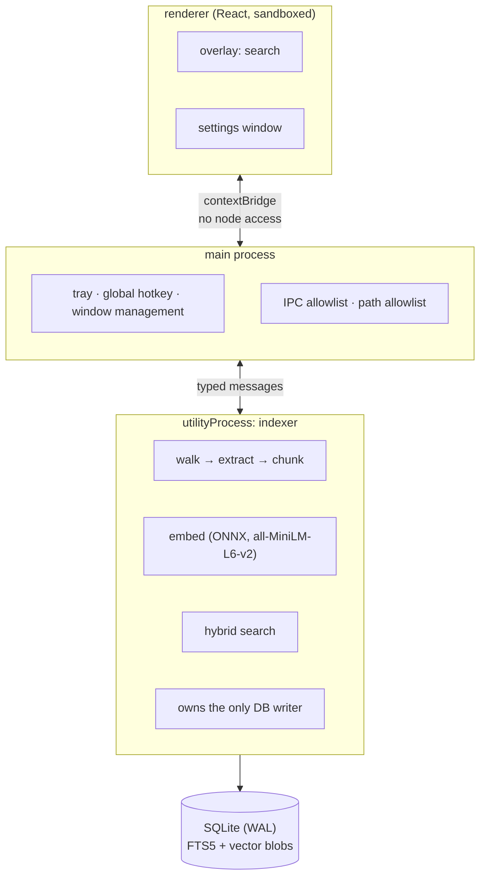

# Trove

**Offline semantic search for your own files.** Press a hotkey anywhere in Windows, type what
you half-remember, and get the passage back — matched by *meaning*, not keywords.

Everything runs on your machine. No account, no API key, no server, and nothing is uploaded.

> **Demo GIF goes here.** Record it with the recipe in [Recording the demo](#recording-the-demo),
> save it to `docs/demo.gif`, then replace this block with:
> ``

---

## The one query that explains the project

> **"how do I get paid"** → finds a document titled **Invoicing Procedure**

That document contains *"Salaries are transferred on the last working day of the month."* It
shares **no content words** with the query. Keyword search returns nothing for it. Trove ranks
it **first**.

That case is not a screenshot — it is an assertion in the benchmark suite, and the build fails
if it regresses.

---

## Measured

`npm run corpus && npm run bench` — 1,202 synthetic markdown documents, Windows 11, Electron 43,
CPU only (no GPU).

| | |
|---|---|
| Files indexed | 1,202 → 2,202 passages, 0 failed |
| Cold index time | **21.0s** |
| ├ scan, extract, chunk | 1.8s (9%) |
| └ embedding | 19.2s (91%) |
| Embedding throughput | ~105 passages/sec · ~13,400 tokens/sec |
| **Search latency** | **p50 4ms · p95 6ms · max 7ms** |
| Peak RSS | 61MB |
| Index on disk | 9MB |

> Passages/sec is meaningless without passage size — an early probe on one-line texts read
> 853/sec, which is the *same model* at lower token throughput. Quote tokens/sec, or state the
> corpus.

---

## Why this isn't a web app

The honest question about any Electron project is "could this have been a website?" Trove
answers it five ways:

- a **transformer model runs locally**, on the CPU, with no network call
- a **global hotkey** works with no window open and over fullscreen apps
- it **indexes the filesystem** in the background and watches it for changes
- it holds a **persistent local index** with full-text and vector search
- it works **with the network cable unplugged**

---

## How it works



**Three processes, because embedding must never block the hotkey.** A full index run is ~20
seconds of continuous CPU; running that anywhere near the UI thread makes the app feel broken.
`utilityProcess` is Electron's purpose-built Node child — real Node context for the ONNX
runtime, crash-isolated, and it keeps running with every window closed.

### Retrieval

Two legs, fused. Each fails exactly where the other works:

| leg | good at | blind to |
|---|---|---|
| **BM25** (SQLite FTS5, porter stemming) | exact tokens — `ENOENT`, function names, IDs | meaning |
| **Cosine** over 384-dim embeddings | meaning, paraphrase, synonyms | rare literal tokens |

They are combined with **Reciprocal Rank Fusion**:

```
score(d) = Σ  1 / (k + rank_i(d))        k = 60
```

RRF uses only each result's **position**, never its score. That matters because the two scores
are incomparable — BM25 is unbounded and negative-is-better in SQLite, cosine is bounded to
[-1, 1]. Normalising them onto a shared scale means inventing a tuning constant and re-tuning it
per corpus. RRF sidesteps the question entirely: rank 1 is rank 1 in any units.

---

## Engineering decisions

**Zero modules that need compiling.** Storage is Node's built-in `node:sqlite` (FTS5, porter
stemming, bm25 — verified inside Electron before committing to it), and the ONNX runtime ships
prebuilt N-API binaries. There is no `node-gyp`, no Visual Studio Build Tools, no
`electron-rebuild`, and CI is a plain `npm ci` on any platform. This was not the original plan —
`better-sqlite3` was, until it turned out not to build on a path containing a space.

**Brute-force vector search, deliberately.** No ANN index. At this scale the arithmetic does not
justify one: the entire corpus is a contiguous `Float32Array` and a full scan is a few
milliseconds. An approximate index would trade exactness, add a dependency and a build step, and
solve a problem this corpus does not have. The interface is kept swappable so `sqlite-vec` is a
contained change if that stops being true. *Measured, then decided* — the 4ms p50 above is the
justification.

**Chunking is retrieval quality.** An embedding is one vector for a whole chunk, so a chunk
spanning two topics lands between both and matches neither. Paragraphs are never split, code
fences stay intact, a new heading forces a boundary, and consecutive chunks overlap by a
sentence-level tail so a passage straddling a boundary survives whole.

**Two-stage change detection.** Re-opening the app after a normal day is near-instant: stage one
compares mtime and size with no file read at all; stage two hashes the bytes, which catches
format-on-save and copies that move mtime without changing content. Only a real edit reaches the
expensive path.

**Failures are retried by extractor version.** A failed file records *which extractor version*
failed it. That distinguishes "a parser bug we later fixed" (retry once, after an upgrade) from
"an encrypted PDF with no password" (never succeeds — stop re-parsing it on every scan). Both
behaviours were needed in practice; see below.

**Security posture.** `contextIsolation` and `sandbox` on, `nodeIntegration` off, and a narrow
`contextBridge` surface with no generic `invoke(channel, …)` escape hatch. Every IPC handler
validates its sender and its payload. Production serves the renderer from a custom `app://`
scheme rather than `file://` — `onHeadersReceived` does not fire reliably for `file://`, so a
header CSP would have silently applied in dev and not in the shipped app. Opening a search
result is restricted to paths main itself just returned, so a compromised renderer cannot turn
it into "open any file on this machine".

---

## Bugs the tests didn't catch (and what changed)

Worth reading, because it is the honest part.

**Every PDF failed.** Stock `pdfjs-dist` needs browser globals (`DOMMatrix`) that a Node utility
process does not have. The unit test passed because its generated fixture was pure text —
pdfjs never reached the code path that builds a matrix. 98 out of 98 real PDFs failed with
`DOMMatrix is not defined`. Fixed by moving to `unpdf`; the fixture now includes graphics
operators so it can actually fail.

**Fixed files were never retried.** Failures were stored with their real mtime and size, so the
metadata gate reported "unchanged" forever — a shipped fix would never reach the files it
repaired. Fixing that naively then meant permanently-unreadable files re-parsed on every scan,
which is what produced the extractor-version scheme above.

**Overlap never fired.** Chunk overlap was carried at whole-paragraph granularity, but a
paragraph almost always exceeds the overlap budget, so the carry loop broke immediately. The
feature was dead code for every realistic document until it became sentence-level.

**The portable build overwrote the installer.** Both electron-builder targets shared one
`artifactName`, so they wrote the same filename — and `latest.yml` was left describing an
artifact that no longer existed, which would have broken auto-update for every user.

---

## Install

Grab the latest from [Releases](../../releases):

- `Trove-Setup-x.y.z-x64.exe` — installer
- `Trove-Portable-x.y.z-x64.exe` — single file, no install

> **The builds are unsigned.** SmartScreen will warn on first run: **More info → Run anyway**.
> A code-signing certificate is a few hundred dollars a year and this is a portfolio project.

First launch downloads a ~22MB language model once, into your user data folder. After that it
never touches the network.

---

## Development

```bash
npm install
npm run dev            # hot-reloading app
npm test               # 106 unit + integration tests
npm run typecheck
npm run dist           # Windows installer + portable into release/
```

Benchmarks:

```bash
npm run corpus         # generate 1,202 synthetic documents
npm run bench          # index them, then measure search
```

`npm run bench` exits non-zero if p95 latency regresses past 150ms or if either semantic
retrieval assertion fails, so it is usable as a gate.

### Layout

| path | what |
|---|---|
| `src/core/` | pure Node — chunker, extractors, search, storage. No Electron imports, so it is directly testable |
| `src/worker/` | the indexing utility process |
| `src/main/` | lifecycle, tray, hotkey, windows, IPC |
| `src/renderer/` | React overlay + settings |
| `scripts/bench/` | benchmark harness (runs the real worker under real Electron) |

### Recording the demo

The GIF above is the single highest-value thing in this README. Record it with
[ScreenToGif](https://www.screentogif.com/):

1. `npm run corpus`, then index `.corpus/` so there is something to search
2. Record ~10 seconds: press the hotkey → type *"how do I get paid"* → results appear → Enter
3. Crop to the overlay, target < 5MB, save to `docs/demo.gif`

---

## Limitations

- **Windows-first.** The build config targets Windows; macOS/Linux are unbuilt and untested.
- **Scanned PDFs return nothing.** No OCR — an image of text has no text layer.
- **Encrypted PDFs are skipped.** No password prompt.
- **Brute-force search is linear.** Fine to tens of thousands of passages; a much larger corpus
  wants an approximate index.
- **English-centric.** The model and the stop-word list are tuned for English.

## License

MIT — see [LICENSE](LICENSE).
